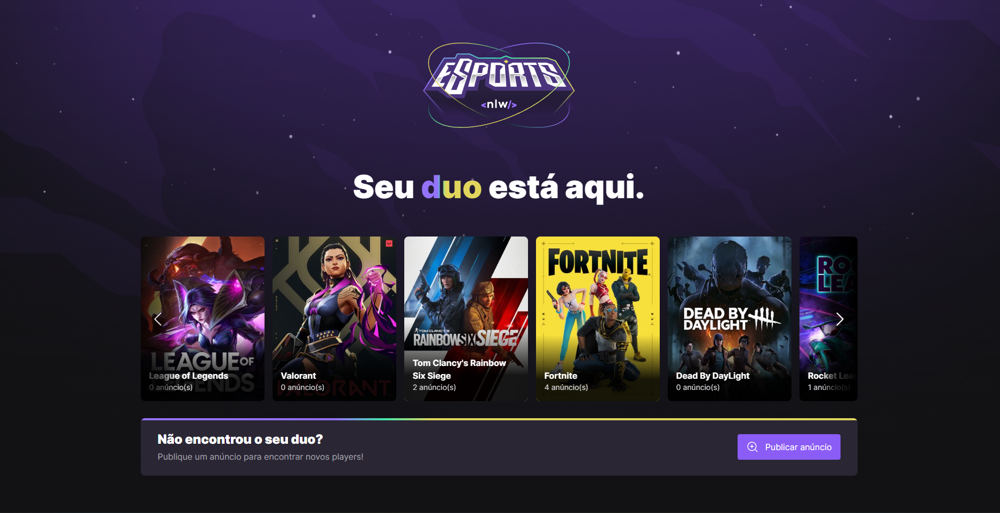
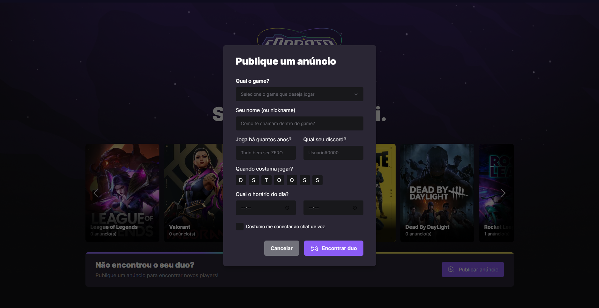
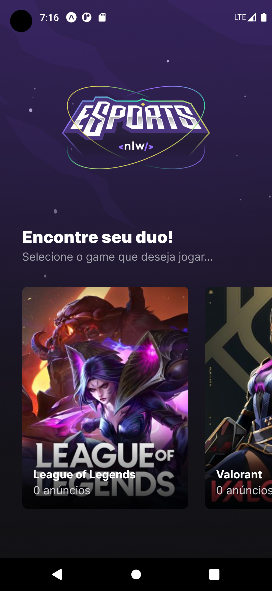
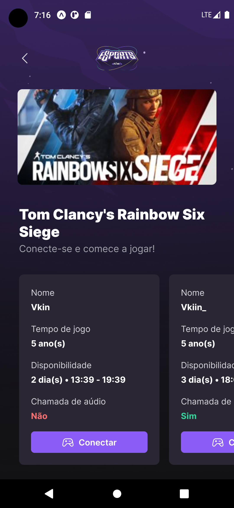
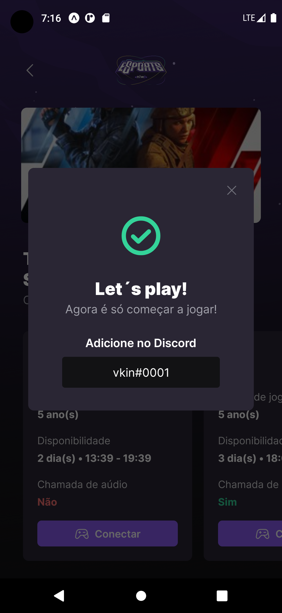

## NLW ESPORTS

This project was made exclusively for study reasons.

### Install the dependencies

- After clone the project open the folder in terminal and run:  

 ```
yarn install-all
```
or
```
npm install-all
```
<br/>

## Running the web and server project

- Access the folder server and run the command:

```
yarn dev
```
or
```
npm run dev
```

- Access the web folder and run the command:

```
yarn dev
```
or
```
npm run dev
```

After open your browser in your localhost address

- To run mobile enter in folder mobile and run the command:

```
expo start
```

## Demo

### WEB
Index             |  Create ad
:-------------------------:|:-------------------------:
  |   

### Mobile
Home Screen                |  Game Screen                  |  Discord Modal
:-------------------------:|:-------------------------:|:--------------------:
  |   | 
### 🚀 Technologies used:
- TypeScript 
- React 
- NodeJS 
- React Native
